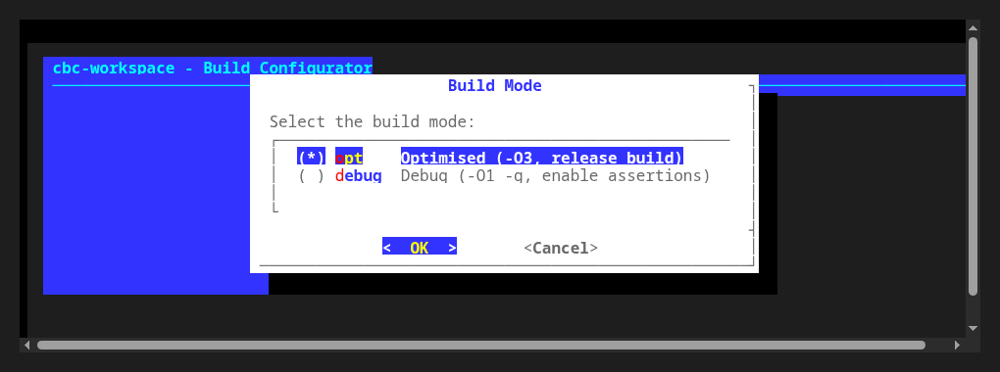
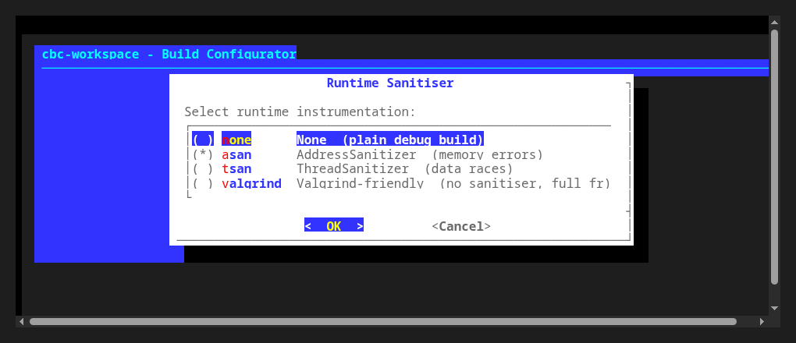
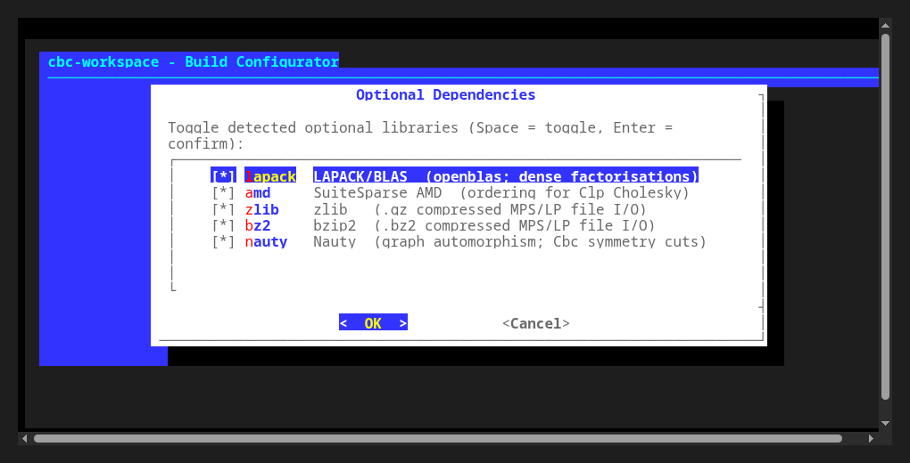
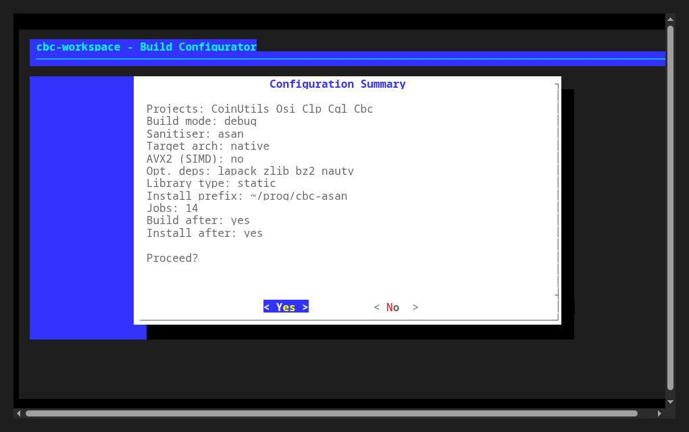

# cbc-workspace

Multi-repository development workspace for the COIN-OR **Cbc** MIP solver and its
direct dependencies, wired together as git submodules:

```
CoinUtils -> Osi -> Clp -> Cgl -> Cbc
```

Each submodule tracks the official `coin-or/<repo>` upstream, checked out on a
`next` branch (see `AGENTS.md` for the full branching convention).

**Goal:** provide a comfortable, self-contained workspace for developing Cbc and
its dependencies together — usable equally well by human developers and by
coding agents/bots, with a single entry point (`./config`) to configure the
whole stack and a single command (`./build`) for correct, dependency-aware
incremental rebuilds afterwards.

## Quick start

```sh
git clone --recurse-submodules git@github.com:h-g-s/cbc-workspace.git
cd cbc-workspace

# Interactive configuration wizard:
./config

# Or non-interactive, configure + build + install everything:
./config --opt --install --prefix=~/prog/cbc

# Later, incremental rebuilds after editing sources (dependency-aware,
# always builds AND installs whatever changed + its downstream dependents):
./build
```

## `config` examples

```sh
# Optimised (release) build, installed to ~/prog/cbc:
./config --opt --install --prefix=~/prog/cbc

# Debug build with AddressSanitizer, installed to its own prefix
# (debug builds are suffixed automatically, e.g. ~/prog/cbc-asan):
./config --debug --sanitizer=asan --install --prefix=~/prog/cbc

# Debug build with ThreadSanitizer:
./config --debug --sanitizer=tsan --install --prefix=~/prog/cbc
```

`config` also lets you pick the target CPU architecture (`--arch=...`), toggle
hand-written AVX2 SIMD paths, select which optional dependencies to link
(LAPACK/OpenBLAS, AMD, zlib, bz2, Nauty — auto-detected, Homebrew-aware), and choose
static/shared/both library types. Run `./config --help` for the full list of
flags, or just run `./config` with no arguments for the interactive wizard.

### Wizard screenshots

| Build mode | Sanitiser (debug only) |
|---|---|
|  |  |

| Optional dependencies | Configuration summary |
|---|---|
|  |  |

## `build`

```sh
./build              # rebuild whatever changed (+ dependents), then install
./build --force       # force a full rebuild + install of all 5 projects
./build CoinUtils     # rebuild only this project and everything that depends on it
```

`build` tracks each submodule's git commit + dirty-tree state and automatically
force-rebuilds every downstream dependent whenever an upstream project's
sources changed (e.g. editing `CoinUtils` forces `Osi`, `Clp`, `Cgl`, and `Cbc`
to rebuild too). Every rebuilt project is always `make install`-ed immediately
afterwards, since downstream projects discover their dependencies through the
shared prefix's installed headers/libraries/`.pc` files, not the in-tree build
output.

## `test`

```sh
./test                          # run the full mip-sanity-data suite (all cores)
./test --jobs=4                 # cap parallelism
./test 'bpc_*' 'cvrp_*'         # only run instances matching these glob patterns
```

`test` (a symlink to `Cbc/test/run-mip-sanity-tests`) builds Cbc's regression
suite around [`mip-sanity-data`](https://github.com/h-g-s/mip-sanity-data): a
collection of MIP instances with known optimal/best-known solutions. It runs
`k` instances in parallel (`k` = number of cores by default, one Cbc thread
each), honoring the node/time limits suggested per-instance in `limits.tsv`,
then validates every saved solution's feasibility (bounds, integrality,
constraints) and objective value against the recorded best-known solution —
flagging any claimed-optimal solution that doesn't match the recorded optimum
within tolerance.

Output stays brief while everything goes well — one live-streamed line per
instance as it finishes, colored in the terminal (green `✔` for pass, yellow
`⏱` for overtime/hard-kill, red `✗` for fail/error) — and expands to full cbc
+ validator logs automatically for anything that fails:

```
=== Cbc mip-sanity-data regression suite (jobs=12) ===
365 instance(s) selected (of 365 total).

Running... (results stream in as instances finish; order is by completion, not by name)
[  1/365] ✔ bpc_n12_c150_sd42_clique_diverse            (0.1s)  Optimal solution found  obj=4  nodes=0
[  6/365] ✔ bpc_search_n13_c150_sd137_random_d0.2_uniform (2.9s)  Optimal solution found  obj=4  nodes=224
[ 18/365] ✔ cttp_infeasible_c10t12_r2-4_sd2              (0.5s)  Infeasible (detected in presolve/root)  nodes=0
[ 94/365] ✗ fcnf_search_n55_d10_s3_4_sl0.95_sd7          (31.3s)  Optimal solution found  obj=10980.59  nodes=2630  MISMATCH: claimed-optimal objective 10980.59 does not match best-known value 10979.16 — full details below
[362/365] ✔ upms_n9_m3_int_cmax_s137                    (120.2s)  Stopped on time limit  obj=57  bound=45  gap=26.67%  nodes=150836

=== Summary ===
  Result                              Count
  ────────────────────────────────────────
  Passed                                363
  Failed                                  2
  Overtime                                0
  Error                                   0
  ────────────────────────────────────────
  Total                                 365

=== Solve statistics ===
  Metric                              Value
  ────────────────────────────────────────
  Optimal solutions found         284 / 365
  Total runtime                     8660.0s
  Total nodes processed           3,533,952
  Average gap                         4.36%

  Slowest instance:          upms_n9_m2_lgset_cmax_s137  (301.0s)
  Most nodes processed:      upms_n9_m2_lgset_cmax_s137  (669,332 nodes)

=== Failure details ===
─── fcnf_search_n55_d10_s3_4_sl0.95_sd7 ─────────────────────────────────────────────
-- cbc log (.../fcnf_search_n55_d10_s3_4_sl0.95_sd7.cbc.log) --
...full cbc + validator output for diagnosis...
```

`test` runs automatically in CI (`Cbc/.github/workflows/sanity-tests.yml`)
right after building Cbc. See `Cbc/test/run-mip-sanity-tests` and
`Cbc/test/cbc_validate_sol.cpp` for the orchestrator/validator implementation.

### Checking for regressions — `compare-results`

Every `./test` run saves a per-instance results table (tab-separated:
`instance status elapsed_s nodes gap_pct is_optimal obj bound`) to
`Cbc/test/sanity-results/results.tsv` by default; pass `--results-tsv=PATH`
to save it elsewhere. When developing a solver change, save a baseline
before and after your change, then diff the two with `./compare-results`
(a symlink to `Cbc/test/compare-mip-sanity-results`):

```sh
./test --results-tsv=/tmp/baseline.tsv        # before the change
# ...make solver changes, rebuild with ./build...
./test --results-tsv=/tmp/after.tsv           # after the change
./compare-results /tmp/baseline.tsv /tmp/after.tsv
```

It reports aggregate deltas (passed/failed/overtime/error counts, confirmed
optimal count, average gap) and lists every per-instance regression (newly
errored/overtime, newly failed validation, lost a confirmed optimum, or a
wider gap) and improvement, then exits non-zero if any regression was found
— so it's safe to use as a gate in a script. See
`Cbc/test/compare-mip-sanity-results` for the full option list
(`--gap-tol`, `--no-color`).

## `fetch-ci-build`

```sh
./fetch-ci-build                       # trigger a CI build + install to ~/prog/cbc-ci
./fetch-ci-build --no-trigger          # skip triggering; use the latest existing run
./fetch-ci-build --prefix=/tmp/cbc-ci  # install elsewhere
```

Triggers `coin-or/Cbc`'s "Next branch release builds" workflow (which itself
builds via this repo's `config`/`package` scripts), waits only for the job
matching the local OS/architecture, downloads that platform's relocatable
artifact, and installs it — so tests can run against an "official" CI-built
binary instead of a local build. Requires the `gh` CLI (authenticated) and
`jq`. Run `./fetch-ci-build --help` for the full option list.

See `AGENTS.md` for full documentation: build system details, branching
convention, dependency-aware rebuild rules, and testing guidance.
